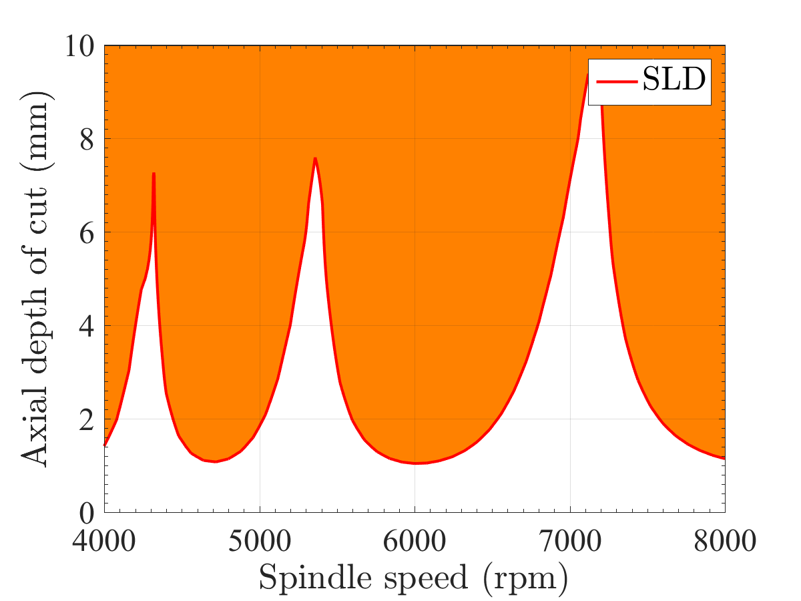
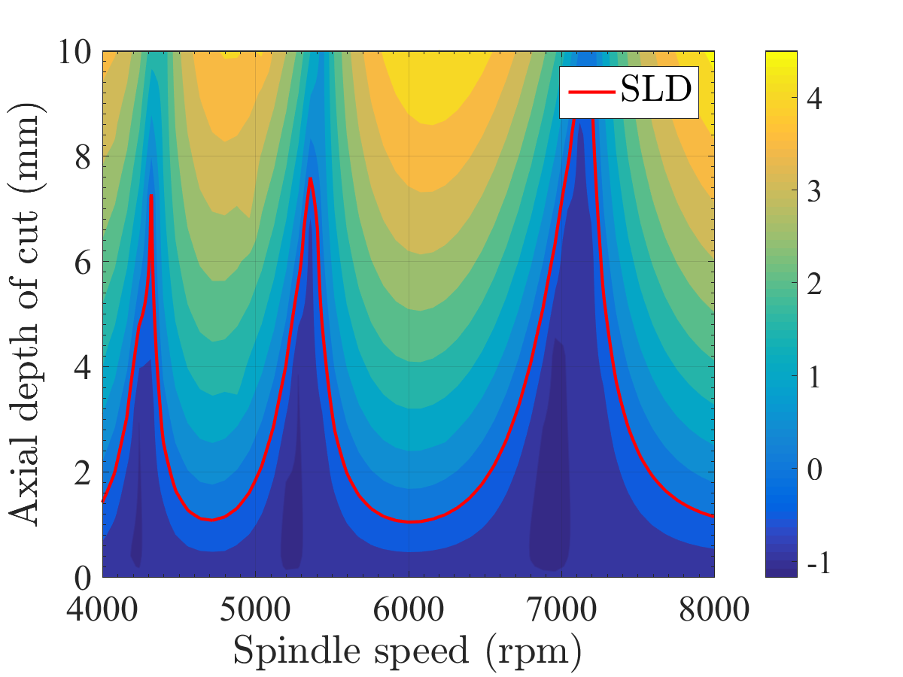

## Synopsis

*Multirate Chatter Analysis* is an analysis of chatter vibration.

## Example

To use this, just type in MATLAB

    run_MCA

Then you will get these results:

Stability Lobe Diagram.

Singular-Value Map With Stability Lobe Diagram.

You can change some parameters shown below for your analysis.

In `data/make_Global.m`, you can edit

    AE %Radial depth of cut (m)
    D %diameter of tool (m)
    FLUTES % number of teeth
    UP_OR_DOWN %UP(1) or DOWN(-1) MILLING
    W_ST % starting depth of cut (m)
    W_FI % final depth of cut (m)
    O_ST %starting spindle speed (rad/s)
    O_FI %final spindle speed (rad/s)
    TAU_NORM %nominal period \tau for SLD (s)
.

In `data/make_SDM.m`, you can edit

    SDM.stx % steps of spindle speed
    SDM.sty % steps of depth of cut
    SDM.k %tau = k dt
.

In `data/make_Tool.m`, you can edit
    
    Tool.plant %Tool plant system (should be 2 input (Fx, Fy) 2 output (x, y))
.
    
In `data/make_Work`, you can edit

    Work.Kt %Cutting Force Coefficient in the tangential direction
    Work.Kn %Cutting Force Coefficient in the normal direction
.

Copyright and License
=============

	2018-, Shimoda Takaki, The University of Tokyo

mypy is free software; you can redistribute it and/or modify it under the terms of the GNU General Public License as published by the Free Software Foundation; either version 3 of the License, or (at your option) any later version.

mypy is distributed in the hope that it will be useful, but WITHOUT ANY WARRANTY; without even the implied warranty of MERCHANTABILITY or FITNESS FOR A PARTICULAR PURPOSE. See the GNU General Public License for more details.

